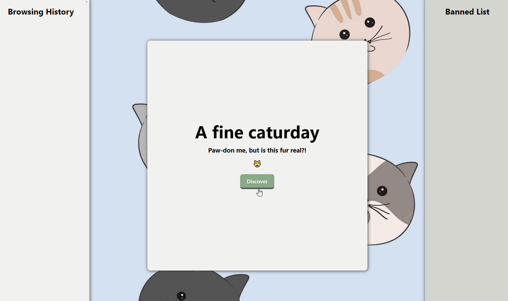

# Web Development Project 4 - *Caturday - Project 4*

Submitted by: **Hafsa Sarker**

This web app: **Lets the user query through different cats, randomly, from the cat API. The user can filter through different cat attributes by clicking on any of the attributes. On the left, the user can also see their browsing history.**

Time spent: **10** hours spent in total

## Required Features

The following **required** functionality is completed:

- [X] **Clicking a button creates a new API fetch request and displays at least three attributes from the returned JSON data**
- [X] **Only one item/API call is viewable at a time**
- [X] **API calls appear random to the user**
- [X] **At least one image is displayed per API call**
- [X] **Clicking on a displayed value for one attribute adds it to a displayed ban list**
- [X] **Attributes on the ban list prevent further images/API results with that attribute from being displayed**

The following **optional** features are implemented:

- [X] Multiple types of attributes can be added to the ban list
- [X] Users can see a stored history of their previously viewed items from their session

The following **additional** features are implemented:

* [ ] List anything else that you added to improve the site's functionality!

## Video Walkthrough

Here's a walkthrough of implemented user stories:

GIF created with liceCAP 

## Notes

While building this app, I was confused with the use of the effect hook. So I made a "smart" choice to just avoid it completely. After analyzing my console, and seeing the infinite API requests I was making, I thought, maybe if I just call the API once when the App component loads, I won't get the infinite amount of API data. But I did not know how to achieve this. Finally, I decided to teach myself how to properly fetch data from API in React (as I should've done from the beginning to save myself a lot of time being wasted). Finally, I learned that useEffect() was the friend I needed all along. 

## License

    Copyright [2023] [Hafsa Sarker]

    Licensed under the Apache License, Version 2.0 (the "License");
    you may not use this file except in compliance with the License.
    You may obtain a copy of the License at

        http://www.apache.org/licenses/LICENSE-2.0

    Unless required by applicable law or agreed to in writing, software
    distributed under the License is distributed on an "AS IS" BASIS,
    WITHOUT WARRANTIES OR CONDITIONS OF ANY KIND, either express or implied.
    See the License for the specific language governing permissions and
    limitations under the License.